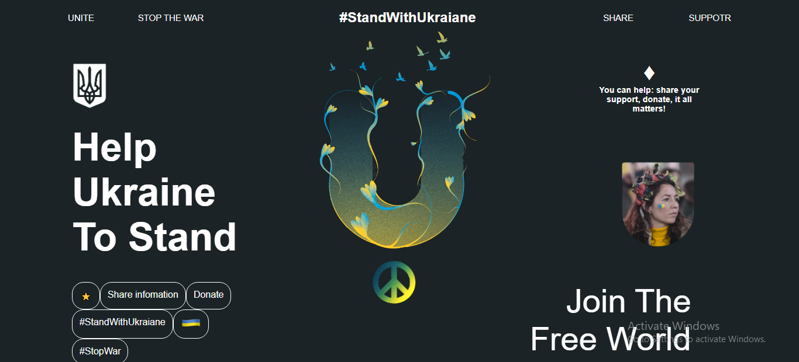

#  Hey floks, Today,I am sharing a UI Design to support Ukraine.
## It was a nice experince while coding this.
## I hope you enjoy it
<i> This design is for Desktop responisve only. </i>

+ 

## 🔗 Links

## Support

If you like this project, please consider supporting it by giving a ⭐️.

